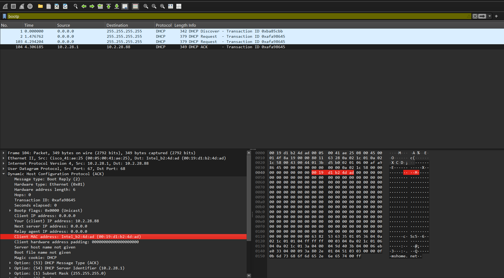
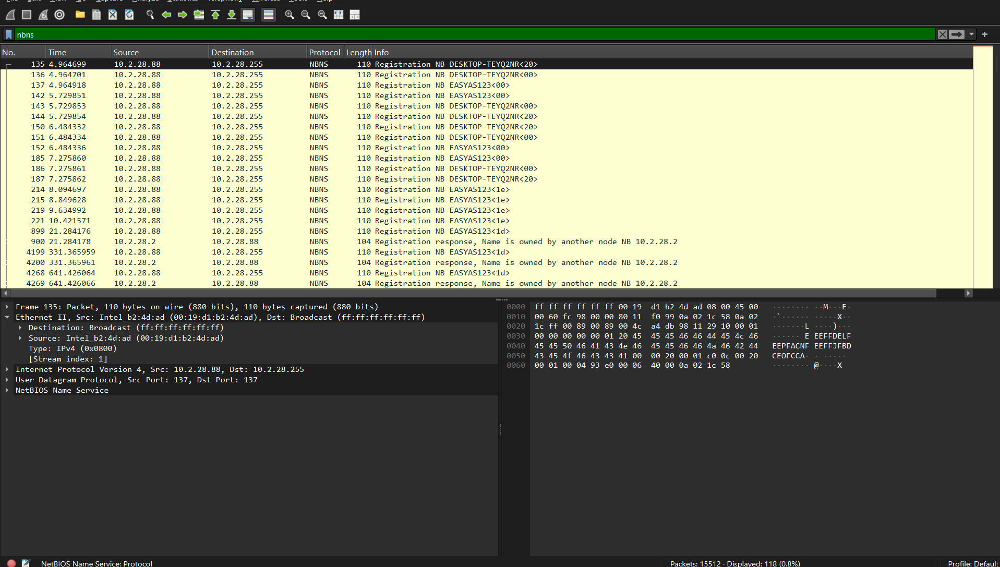
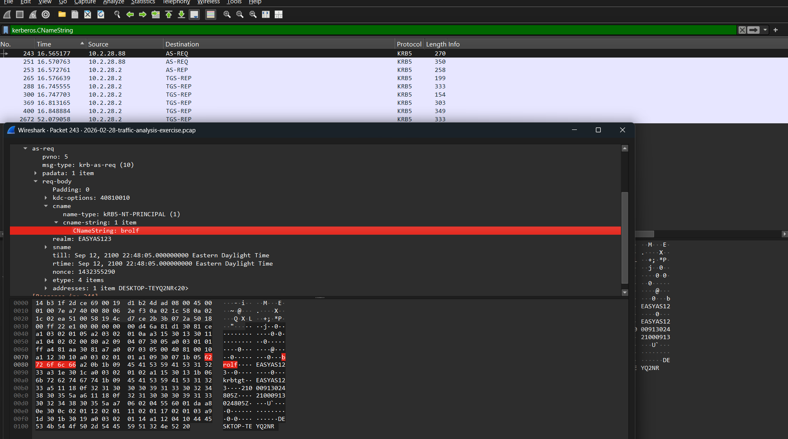
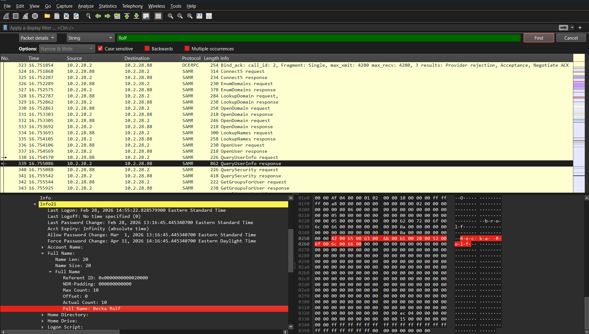

# Enterprise Incident Response: Malicious Packet Capture Analysis
**Author:** Asim Mahmood
**Tools Utilized:** Wireshark Desktop (Packet Analysis Architecture)
**Dataset Baseline:** Malware-Traffic-Analysis.net Training Exercise

## 1. Executive Summary
This project details a deep-dive forensic network investigation of an active endpoint compromise within a corporate Windows Active Directory domain environment (`10.2.28.0/24`). Utilizing Wireshark, I systematically tracked down the initial identity allocation parameters of the target host, isolated the explicit logged-in employee credentials, mapped system naming parameters, and exposed high-frequency Command and Control (C2) beaconing vectors tied to a malicious **NetSupport RAT (Remote Access Trojan)** deployment.

---

## 2. Phase 1: Host & Hardware Profile Discovery
To map out the target environment, I initiated an application-layer protocol audit using the `bootp` filter. This isolated the exact bootstrap transaction where the local router (`10.2.28.1`) confirmed the dynamic IP profile mapping.

*   **Assigned Host Private IP:** `10.2.28.88`
*   **Physical Hardware MAC Address:** `00:19:d1:b2:4d:ad` (Intel Corporation)

Next, I applied a NetBIOS Name Service (`nbns`) filter to capture local environment name registration broadcasts. This step successfully linked the temporary network lease to the asset's persistent corporate hardware tag:

*   **Identified Machine Host Name:** `DESKTOP-TEYQ2NR`

---

## 3. Phase 2: User Identity & Account Extraction
To confirm which user profile was active during the compromise window, I targeted authentication handshakes over the Kerberos protocol using the `kerberos.CNameString` criteria. Opening the deep-packet string details revealed the authenticated organizational target profile:

*   **User Account Identifier:** `brolf`
*   **Active Directory Security Realm:** `EASYAS123` (Corporate Network Scope)

To finalize the personnel profile for the formal incident report, I executed a text string search across the Security Account Manager (SAMR) query frames. This directly mapped the internal user handle to the employee's documented corporate identification records:

*   **Target Personnel Full Name:** `Becka Rolf`

---

## 4. Phase 3: Exposing the Malware Command & Control (C2) Stream
With the target parameters locked, I filtered for unencrypted external traffic metrics using `http.request`. This step instantly exposed a severe anomaly: the victim host was executing high-frequency HTTP `POST` requests to an unauthorized external IP node.

*   **Attacker C2 Destination IP:** `45.131.214.85`
*   **Malicious Endpoint URI Path:** `/fakeurl.htm`
*   **Software Agent Identification (User-Agent):** `NetSupport Manager/1.3`
*   **Command Payload Variable:** `CMD=POLL`

### Forensic Findings:
The explicit payload metadata variables (`CMD=POLL`) prove this is an active remote takeover event. The computer is automatically checking in with the attacker's web controller every few seconds to download unauthorized system execution commands, confirming a full **NetSupport Remote Access Trojan (RAT)** compromise.

---

## 5. Containment & Incident Response Action Matrix
Based on the explicit network evidence extracted during this traffic analysis, I drafted the following active containment playbook:

1.  **Immediate Host Isolation:** Execute an active directory network disconnect order against MAC address `00:19:d1:b2:4d:ad` to immediately kill the outbound data exfiltration pipeline.
2.  **Gateway Traffic Mitigation:** Update edge firewall rules to globally drop all inbound and outbound traffic targeting `45.131.214.85` across all ports.
3.  **Identity Suspension:** Temporarily freeze the Active Directory user account `brolf`, terminate all active cloud authentication tokens, and initiate a forced enterprise security credential reset.
